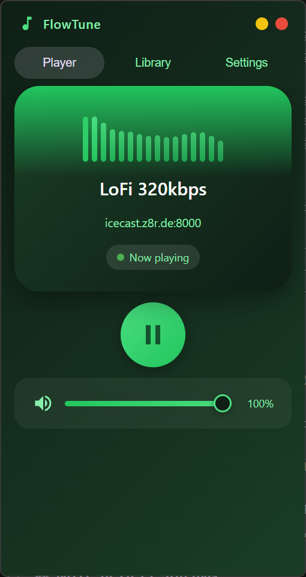
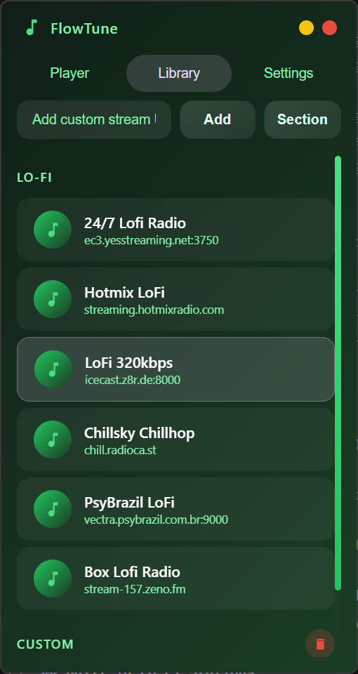
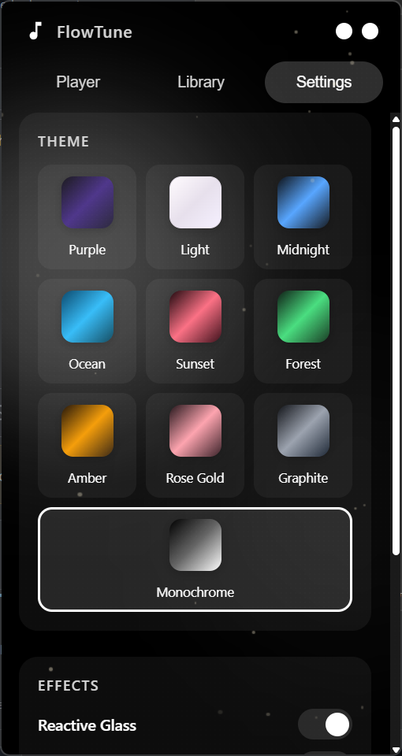

# LoBeats

<p align="center">
  
  
  
  
</p>

LoBeats is a desktop internet radio player built with Electron.

Version **1.5.3** refines the visual system and UX with in-app update checks, custom dropdown controls, and polish across themes and settings.

## Highlights (v1.0.0)

- Full station management: add, edit, move, and delete both built-in and custom stations
- Section system for organizing stations
- Custom right-click context menu in Library (Play / Edit / Delete)
- Visual Effects Pack:
  - Reactive Glass
  - Theme Aura
  - Weather FX Pack (Snow / Rain / Dust / Stars + intensity)
  - Pixel Mode
  - Now Playing Pulse
  - Ambient Noise Texture
- In-app update flow in Settings (check latest release + direct download)
- Custom-styled dropdown controls for Weather FX settings
- Monochrome theme and improved theme behavior

## Core Features

- Internet radio streaming (HTTP/HTTPS)
- Built-in real-time audio visualizer
- System tray support (show/hide, play/pause, exit)
- Persistent settings and station data via localStorage

## Themes

- Purple
- Light
- Midnight
- Ocean
- Sunset
- Forest
- Amber
- Rose Gold
- Graphite
- Monochrome

## Built-in Lo-Fi Stations

- 24/7 Lofi Radio
- Hotmix LoFi
- LoFi 320kbps
- Chillsky Chillhop
- PsyBrazil LoFi
- Box Lofi Radio

## Screenshots

### Main Player


### Library


### Settings


## Installation

### Option 1: Prebuilt app

Download these files from GitHub Releases:

- `LoBeats-windows.exe` (Windows)  
  `https://github.com/alnyxcs/LoBeats/releases/latest/download/LoBeats-windows.exe`
- `LoBeats-linux.zip` (Linux)  
  `https://github.com/alnyxcs/LoBeats/releases/latest/download/LoBeats-linux.zip`

### Option 2: Build from source

```bash
git clone https://github.com/alnyxcs/LoBeats.git
cd flowtune
npm install
npm start
```

Production build:

```bash
npm run build
```

Local build output files:

- `dist/LoBeats-windows.exe`
- `dist/LoBeats-linux.zip`

## Project Structure

```text
flowtune/
  src/
    main.js      # Electron main process (window, tray, IPC)
    preload.js   # Context bridge API
    index.html   # UI, styles, and renderer logic
  dist/          # Build output
  package.json   # Scripts and electron-builder config
```

## Tech Stack

- Electron
- HTML/CSS/Vanilla JavaScript
- Web Audio API
- electron-builder
- electron-log

## License

GNU GENERAL PUBLIC LICENSE
